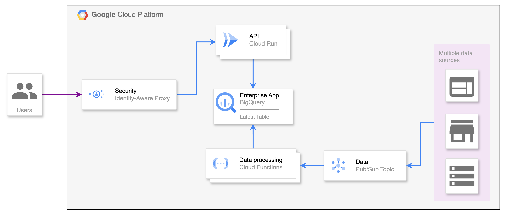

# LTM_Challenge


## Parte 1: Infraestructura e IaC

La infraestructura a desplegar tiene como objetivo desarrollar un sistema en la nube que permite ingestar 
datos desde múltiples fuentes (Aplicaciones, dispositivos IoT, etc), almacenarlos en una base de 
datos optimizada para analítica (BigQuery) y exponerlos a través de una API HTTP. 
Porpongo una arquitectura completamente serverless para maximizar la escalabilidad y reducir 
la complejidad operativa.

### Tecnologías Utilizadas.- 

- **Google Cloud Pub/Sub:** Para la ingesta de datos desde diversas fuentes.
- **Google Cloud Functions:** Para el procesamiento y almacenamiento de los mensajes recibidos desde Pub/Sub.
- **Google BigQuery:** Como base de datos para almacenar y futuro analicis los datos recibidos.
- **Google Cloud Run:** Para el despliegue de la API HTTP que expone los datos almacenados en BigQuery.
- **Identity Aware Proxy (IAP):** Con el uso de IAP nos aseguramos que solo los usuarios auteticados puedan 
acceder a la API. Ademas que nos evitamos manejar la autenticacion dento de la API.
- **Cloud Build:** Como herramienta de CI/CD se utilizo Cloud Build que es una solucion nativa de Google Cloud. La cual 
permite una configuracion rapida y sin mayores complicaciones.

```
🔔 Por motivos de simplicidad se escogio Google Cloud Functions para el procesamiento de datos, 
ya que en este punto se deberia considerar si es Data Streaming o  Batch Processing. Para el 
primero se podria utilizar Cloud Composer y para el segundo DataFlow.
```


## Parte 2: Aplicaciones y flujo CI/CD

### Arquitectura general.-

- **Publicación de Datos:** Los productores de datos (por ejemplo, dispositivos IoT, aplicaciones web) envían datos 
al tópico de Cloud Pub/Sub (_Data_).
- **Procesamiento de Datos:** Una Cloud Function está suscrita al tópico de Pub/Sub (Data) y se ejecuta cada vez que 
se publica un nuevo mensaje. Esta función procesa el mensaje y lo almacena en BigQuery.
- **Consulta y Exposición de Datos:** Los usuarios finales pueden hacer solicitudes HTTP a la API 
desplegada en Cloud Run. La API realiza consultas a BigQuery para recuperar los datos solicitados y 
los devuelve en la respuesta HTTP.




### Despliegue de la API
Para desplegar la API en Cloud Run utilizando el [pipeline](./build/cloudbuild.yaml) , se han
seguido los siguientes pasos:

- **Construcción de la imagen del contenedor:**
La API se empaqueta en una imagen de Docker utilizando un Dockerfile específico para FastAPI.
Esto crea un contenedor con el entorno necesario para ejecutar la API.

- **Subir la imagen a Container Registry:**
Una vez construida la [imagen](./build/FastAPI.Dockerfile), se sube al Container Registry de Google Cloud para 
su almacenamiento y posterior uso en el despliegue. 

- **Despliegue en Cloud Run:**
Se utiliza la imagen almacenada en el Container Registry para desplegar la API en Cloud Run.
En el despliegue se incluyen los detalles de configuracion como la región, el puerto (8000), 
los recursos asignados (2Gi de memoria, 1 CPU), y un mínimo de 1 instancia activa. Para esto se 
ultilizo _**gcloud cli**_, la cual es la linea de comandos proporcionada por GCP.